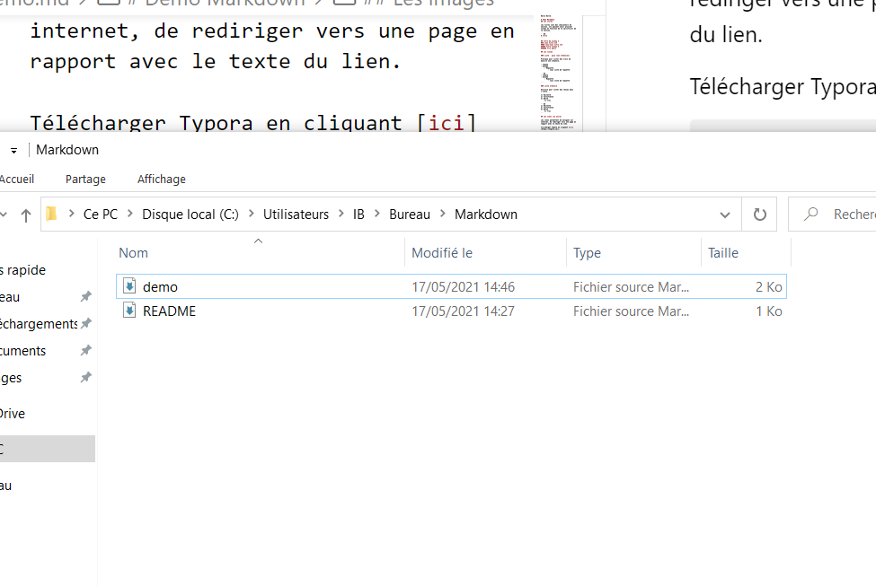

# Demo Markdown
## Les titres

Les titres sont des indicateurs de section. Ils peuvent avoir plusieur niveau en fonction de la spécificité de la section.

```md
# Titre
```

## Titre de niveau 2
### sous titre nv3
#### sous-sous titre nv4
##### Titre niveau 5
###### trés petit

## Les listes

### Liste à puce (non ordonnées)

Pratique pour lister des trucs de manière non ordonnée.

- Tomate
- Salade
    - Roquette
        - sous liste de roquette

```md
- Tomate
- Salade
    - Roquette
        - sous liste de roquette 
```

### Liste ordonnée

Utilisée pour lister des choses dans l'ordre.

1) Raclette
2) Tartiflette
3) Welsh
    1) truc

```md
1) Raclette
2) Tartiflette
3) Welsh
    1) truc
```

## Les liens (ou ancre)

Les liens permettent de naviguer sur internet, de rediriger vers une page en rapport avec le texte du lien.

Télécharger Typora en cliquant [ici](https://typora.io/).

```md
Télécharger Typora en cliquant [ici](https://typora.io/).
```

## Les images

Le principe est similaire pour les images:




```md


```

## Les tableaux

Permet de mettre en valeur des données avec un tableau.

|id|nom|prenom|
|--|---|------|
|1|Dupond|Jean|
|2|Dupont|Jean|
|3|Trabendo|Michel|

## Les emphases

### Texte en gras

Utilisé pour mettre de l'**importance** sur un mot

```md
Utilisé pour mettre de l'**importance** sur un mot
```
### Texte en italique

Utilisé pour dénoter une notion *particulière* au projet.

(c'est important mais pas autant qu'en gras)

```md
Utilisé pour dénoter une notion *particulière* au projet.
```

### Les commandes

Utilisé pour indique d'une chaine de caractère est une commande a entré en `console` par exemple:

(utilisation des magic quotes: alt-gr + 7)

`npm install readfile-sync`

```md
`npm install readfile-sync`
```

### Les notes

> Ce projet est écrit en Markdown mais on peut utiliser du HTML dedans.

```md
> Ce projet est écrit en Markdown mais on peut utiliser du HTML dedans.
```
